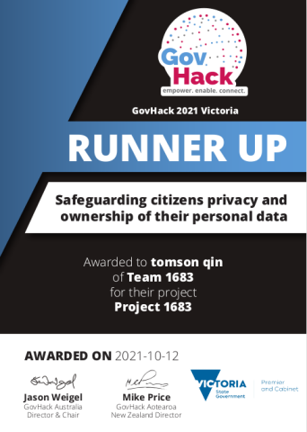

# GovHack2021 Runner up 

# To trust or not to trust?
Is telling survey participants that their answers will remain anonymous really enough to 
elicit truthful responses from participants about sensitive issues?

In this project, we implement protocols to give participants a provably anonymous way to respond
truthfully to such questions without relying on a mere promise of anonymity. 

## Intro
When asked about a sensitive issue, and told "This is an anonymous survey."...

Are you as carefree as bender?

Or as suspicious as Fry?

The issue this Project aims to solve pertains to surveys of sensitive issues on groups of people. Questions like
"Do you think you're smarter than your friends?", "Have you been faithful to your partner?"
Or how about, "have you broken the lock down orders in Melbourne during the past week?"

Can participants really be expected to trust the word of the surveyer, and answer honestly, when the
implications of admission can can range from revelaing personal details to being implicated criminally?

# Trust, but Verify
To "trust, but verify" comes from the rhyming Russian Proverb and is in my opinion a very wise philosophy.

So this weekend I explored 2 methods for the anonymous submission of survey responses that aims to protect the privacy or all participants.

## [Method I: Randomised Response (Click here)](https://tomson.shinyapps.io/randomised-response/)

Randomised response is an easy to understand procedure, used in structured survey interviews, to protect the participants responses. 
The methodology comes from the 1965 paper by Warner and is regularly used in surveys about
doping in sports.

## [Method II: Secure Multiparty Computation (Click here)](https://tomson.shinyapps.io/secure-multiparty-computation/)
Secure Multiparty Computation is a subfield of cryptography which aims to compute functions while keeping inputs private.
The methodology comes from the 1989 paper by Ben-Or. M , Goldwasser. S, Wigderson. A
and is one of the most fundamental results of secure computation.

## Conclusion:
Randomised Response and Secure Multiparty Computation both have their place in the field of anonymous surveys.

Secure Multiparty computation doesn't add noise but Randomised response surveys do not require long computations.

This project seeks to be an accessible educational resource so people can learn, understand
and verify the methodologies described. Only that way can people understand, rather than be expected to trust, in the privacy 
they are guaranteed with these methods.

## About me:

Hi and Welcome! My name's Tom and I'm a recent graduate living in the Melbourne Lockdown. If you would like to contact or collaborate with me, reach out to me on [Linkedin](https://www.linkedin.com/in/tomson-qin-43bb44190/).

## Challenges
### [ Safeguarding citizens privacy and ownership of their personal data ](https://hackerspace.govhack.org/challenges/safeguarding_citizens_privacy_and_ownership_of_their_personal_data)

It is clear from the failure of early contact tracing apps, that Australians care about their privacy, and lacks trust in the government. This will continue to be true and should there be a post pandemic survey asking about people's criminal behavior during lockdown you can expect very few participants will be truthful.
This project presents methods to encourage truthful responses by giving participants confidence (backed by evidence) in the privacy of their answers without relying on a mere promise of anonymity.

### [Reimagining Digital Government Services](https://hackerspace.govhack.org/challenges/reimagining_digital_government_services)

Surveys and questionaires are an important source of information for councils and government's decision-making. However, sometimes the truly important questions councils need to ask are precisely the ones people are not comfortable about answering honestly.
For instance, if you're suffering from a severe drug addiction, would you really be comfortable to disclosing this? This project presents methods to encourage truthful responses by giving participants confidence (backed by evidence) in the privacy of their answers without relying on a mere promise of anonymity.

### [ Building Citizen’s Trust in this Digital World ](https://hackerspace.govhack.org/challenges/building_citizen_s_trust_in_this_digital_world)

In 2018 the Europe Data Protection came into effect. This is a reflection of the human mind's desire for privacy and not to have everything about them known and studied.
However, as more questions are asked about us every year we are slowly divulging more and more of ourselves. Is such a law really going to give confidence to citizens that their data will be managed properly?
By destroying the link between identity and response, insights can still be gained in the aggregate without divulging user privacy, which comes with it the added benefit of encouraging truthful responses.
This project presents methods to encourage truthful responses by giving participants confidence (backed by evidence) in the privacy of their answers without relying on a mere promise of anonymity.

## Papers cited 
https://www.math.ias.edu/~avi/PUBLICATIONS/MYPAPERS/GBW88/GBW88.pdf

https://eprint.iacr.org/2011/136.pdf

https://rpubs.com/aaronsc32/lagrangian-polynomial-interpolation-r

https://www.jstor.org/stable/2283137

https://imai.fas.harvard.edu/research/files/randresp.pdf

STOC '89: Proceedings of the twenty-first annual ACM symposium on Theory of computingFebruary 1989 Pages 73–85https://doi.org/10.1145/73007.73014
